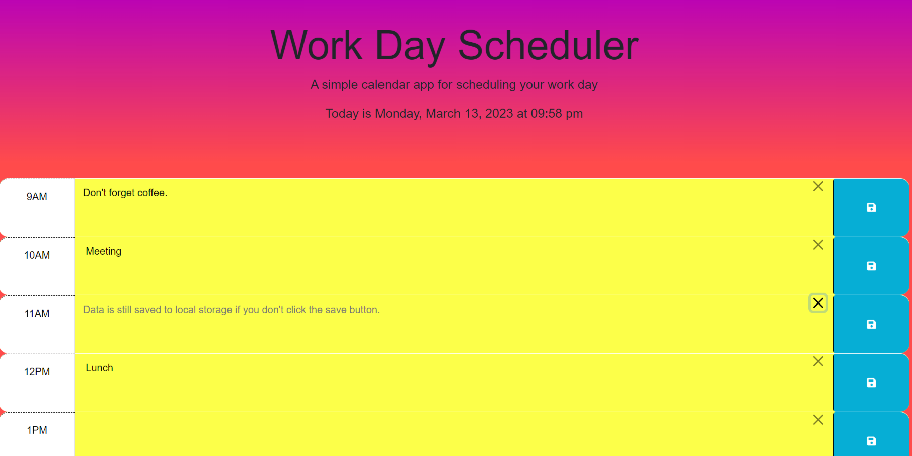

# Daily-Scheduler

## Description

This was the fifth challenge issued to me by the Wash U Coding Bootcamp. The assignment was to take some starter html and css and turn it into a functional daily schedule webpage where users can save reminders and todos for each hour, which would be reloaded when the page is reloaded. Each hour was to be color-coded based on whether it is past, present, or future. 

Working on this challenge taught me a lot about working with Javascript, jQuery, and DOM manipulation. I had a lot of trial and error getting the save function to work, paritially because the DOM manipulation was a little more complicated than I was used to, and because I kept trying to use normal JavaScript syntax with jQuery functions. I got plenty of practice with those things as well as working with DayJs, Bootstrap and being very careful when editing styles affected by it, and understanding the importance of putting certain JS code in a ready function, or just putting your script tags at the bottom of the html.

## Installation

N/A, it's a webpage.

## Usage

The webpage can be found [here](https://wolfspiderman.github.io/Daily-Scheduler/).

When the user loads the page, the current time will be displayed at the top of the page under the title, and any notes they have previously saved to their local storage will automatically be loaded back into the hour block they were saved in. If the user scrolls through the page, each block for an hour that has already passed will be yellow, the current hour will be green, and upcoming hours will be blue. If the user clicks into an hour block, they will be able to input text, such as reminders or todo items. To the far right of the block, there is a save button that, when clicked, will save the users text input into the local storage. There is also a small x to the left of the save button, within the text block, that, when clicked, will delete any text from the block but will not delete it from the local storage. If the user has data saved in the local storage, the delete button will also display a placeholder message to inform them that the data is still in the local storage.

The following is a screenshot of what the page looks like with some saved data after a refresh, one of which was just deleted.

## Credits

I was given the starter code for this assignment by Washington University St. Louis's Coding Boot Camp.

For this project, I used the lesson materials from the boot camp, as well as the [jQuery](https://api.jquery.com/) API documents, and the [Day.js](https://day.js.org/docs/en/display/format) API documents.

## License

Licensed under the MIT License.